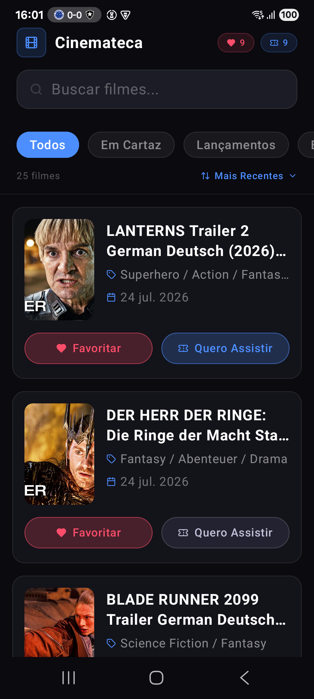
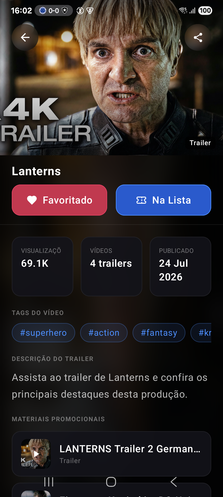
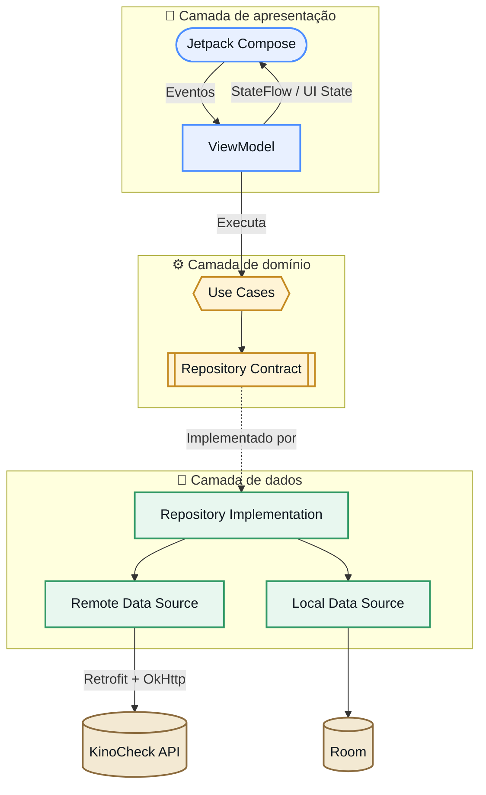
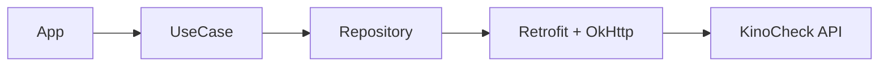

<div align="center">
  

  # Cinemateca

  **Descubra trailers, organize seus filmes e assista aos materiais oficiais.**

  [](https://developer.android.com/)
  [](https://kotlinlang.org/)
  [](https://developer.android.com/compose)
  [](https://m3.material.io/)
  [](#arquitetura)
  [](LICENSE)
</div>

---

# 1 — Visão de negócio

O **Cinemateca** é um aplicativo para descobrir trailers, consultar detalhes e
organizar filmes em favoritos ou na lista “Quero Assistir”.

## Principais recursos

- Pesquisa, filtros e ordenação.
- Favoritos e lista persistidos no dispositivo.
- Detalhes e materiais promocionais.
- Integração com YouTube, navegador e compartilhamento.
- Estados de loading, erro, vazio e sem conexão.

## Screenshots

> [!NOTE]
> Imagens temporárias. Substitua os arquivos em `docs/images/` por capturas
> reais mantendo os mesmos nomes.

|             Home              |               Detalhes               |
|:-----------------------------:|:------------------------------------:|
|  |  |

**Fluxo:** Home → Detalhes → YouTube ou navegador.

---

# 2 — Visão técnica

## Arquitetura

O projeto combina **Clean Architecture**, **MVVM**, **Repository Pattern**,
UseCases, StateFlow, Navigation Compose e injeção de dependência com Koin.



- **View:** Screens e componentes Compose.
- **ViewModel:** processa ações e expõe estado imutável.
- **UseCase:** concentra operações de domínio.
- **Repository:** abstrai API, banco e conectividade.
- **Navigation:** utiliza `HomeRoute` e `TrailerDetailsRoute` serializáveis.
- **DI:** o Koin monta infraestrutura, UseCases e ViewModels.

## Módulos

| Módulo | Responsabilidade |
| --- | --- |
| `:app` | Application, Activity, conectividade Android e composition root. |
| `:features` | Compose, ViewModels, design system e navegação. |
| `:domain` | Modelos, contratos, `Result` e UseCases. |
| `:networking` | Retrofit, OkHttp, Gson, DTOs e adapters remotos. |
| `:local` | Room, DAOs e persistência das seleções. |

## Tecnologias

| Tecnologia | Versão/estado |
| --- | --- |
| Kotlin | 1.9.24 |
| Jetpack Compose | BOM 2024.06.00 |
| Material Design 3 | Via Compose BOM |
| Coroutines / Flow | 1.8.1 |
| ViewModel | 2.8.3 |
| Navigation Compose | 2.8.0 |
| Kotlin Serialization | 1.6.3 |
| Koin | 3.5.6 |
| Coil | 2.7.0 |
| Retrofit / Gson | 2.11.0 |
| OkHttp | 4.12.0 |
| Room | 2.6.1 |
| JUnit / MockK | 4.13.2 / 1.13.12 |
| Robolectric | 4.13 |
| Compose UI Test | Via Compose BOM |
| MockWebServer | 4.12.0 |
| Paging 3 / Media3 | Declarados, ainda não integrados ao fluxo principal |
| DataStore / Turbine / Espresso | Não utilizados diretamente |

## Consumo da API

O aplicativo acessa diretamente a API KinoCheck:



Endpoints integrados:

- `GET /trailers/trending`
- `GET /trailers/latest`
- `GET /trailers`
- `GET /movies`
- `GET /shows`

Respostas HTTP são convertidas para `Result` de domínio. Erros da API,
falhas de conexão e exceções inesperadas são transformados em estados
renderizáveis pela ViewModel.

O módulo aceita uma chave opcional por
`kinoCheckNetworkingModule(apiKey: String?)`. Não versione credenciais.

## Estrutura

```text
Cinemateca/
├── app/          # Aplicação e composition root
├── features/     # UI, ViewModels e navegação
├── domain/       # Modelos, contratos e UseCases
├── networking/   # API e implementações remotas
├── local/        # Room e implementações locais
├── docs/images/  # Imagens do README
└── gradle/       # Gradle Wrapper
```

## Ambiente

| Item | Versão |
| --- | ---: |
| Compile / Target SDK | 34 |
| Minimum SDK | 24 |
| Android Gradle Plugin | 8.4.2 |
| Gradle | 8.6 |
| Kotlin | 1.9.24 |
| Compose Compiler | 1.5.14 |
| Java / JDK | 17 |

Instale Android Studio compatível com AGP 8.4.2, JDK 17, Android SDK 34 e Git.

## Como executar

```bash
git clone https://github.com/tiagocasemiro/Cinemateca.git
cd Cinemateca
./gradlew assembleDebug
./gradlew installDebug
```

No Android Studio, abra o projeto, use JDK 17, sincronize o Gradle e execute o
módulo `app` em um dispositivo Android 7.0 ou superior.

## Testes

```bash
./gradlew test
./gradlew lint
```

Por módulo:

```bash
./gradlew :domain:test
./gradlew :networking:test
./gradlew :local:testDebugUnitTest
./gradlew :features:testDebugUnitTest
./gradlew :app:testDebugUnitTest
```

## Limitações e roadmap

- [ ] Adicionar telas exclusivas de Favoritos e Quero Assistir.
- [ ] Exibir recomendações relacionadas.
- [ ] Integrar Paging 3 e reprodução interna com Media3.
- [ ] Adicionar tema claro.
- [ ] Configurar CI para testes, lint e build.
- [ ] Substituir os placeholders por screenshots reais.

## Contribuição e licença

Crie uma branch, preserve os limites entre módulos, adicione testes e abra um
Pull Request. O projeto é distribuído sob a
[Apache License 2.0](LICENSE).

---

<div align="center">
  Desenvolvido com Kotlin e Jetpack Compose.
</div>
